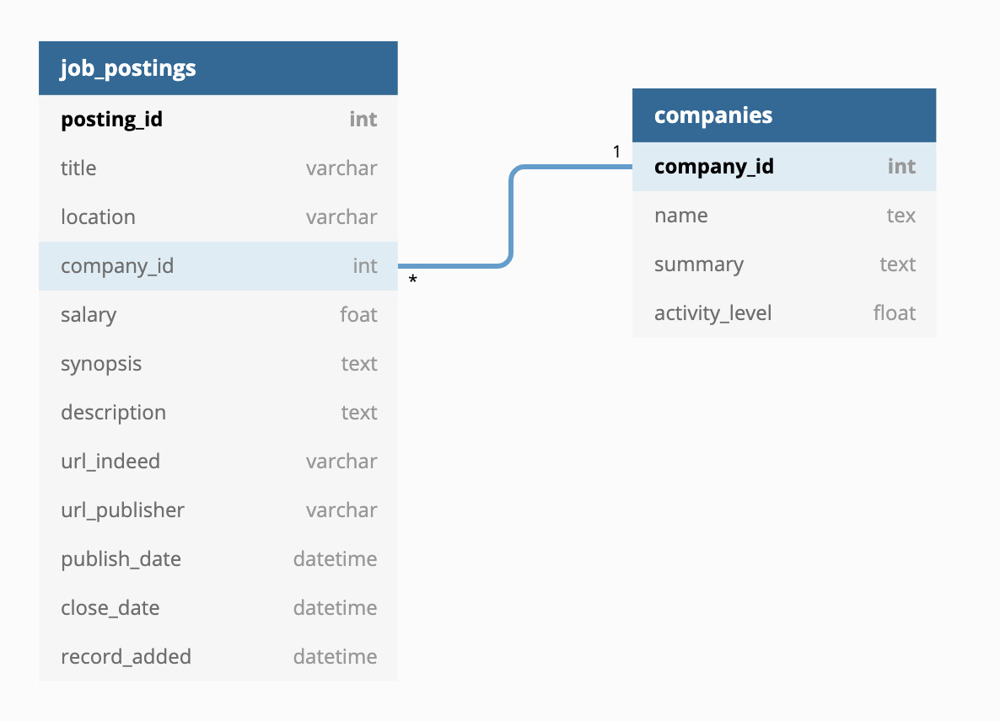

# Indeed_web_scraper


## Brief Description

- Training project to parse job postings from Indeed.com

  

## Installation

- See `requrements.txt` 


## Usage

- `main_module.py` is executed as python script with arguments.

  ```
  - usage: main_module.py <depth>
  - <depth> is number of pages to parse; each page typically consists of 10 job positions
  - <depth> must be more or equal than {LOWER_BOUND} and less or equal than {UPPER_BOUND} pages currently
  - number of pages will be rounded to the nearest ten
  ```

- The output of `main_module.py` is the parsed information and stored in the local SQLite database `jobs.db`
       

## Description

The aim of the project is to parse and collect job postings for market monitoring and analysis. Detecting surges, fades or any unusual events in hiring activity can be a part of such analysis.

Job posting information is parsed from  Indeed.com web-site. Additional information about companies is getting from Wikipedia over API.


**Current project implementation**

- The project consists of 3 modules: `main_module.py`, `tools.py` and `db_manager.py`
    - #### main_module.py
        - Main logic of the program and command-line interface are implemented here.
        
    - #### tools.py
        - The module contains parsing functions. 
        
    - #### db_manager.py
    
        - The module contains functions to create database and insert records to the existing database.
                

## Issues and current project status

- Issues: https://github.com/Hasselfrau/indeed_web_scraper/issues

- Project status: https://github.com/Hasselfrau/indeed_web_scraper/projects/1

  

## Database structure

Name of the database: `jobs.db`

Consists of 2 tables, the main table is `job_postings`



**Table `job_postings`**

Primary key: `posting_id`

Foreign key: `company_id`


**Table `companies`**

Primary key: `company_id`


## Further potential steps:

- Specify operating modes of the program:
  - Parsing
  - User interaction over CLI
    - start/stop of parsing
    - query about database status (e.g. number of records in tables)
  - Other ways of user interaction (e.g. via jupyter notebook)
  - Monitoring
    - raise alarm on pre-defined evens, i. e.:
      - "a company started to hire more people than usual"
      - "a company decreased its activity on hiring people"


